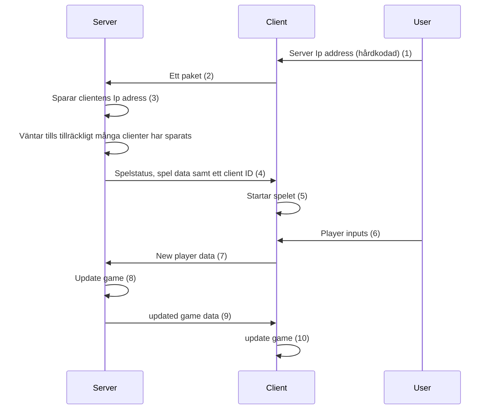

```mermaid
    sequenceDiagram
    participant S as Server
    participant C as Client
    participant U as User

    U->>C: Server Ip address (hårdkodad) (1)
    C->>S: Ett paket (2)
    S->>S: Sparar clientens Ip adress (3)
    S->>S: Väntar tills tillräckligt många clienter har sparats 

    S->>C: Spelstatus, spel data samt ett client ID (4)

    C->>C: Startar spelet (5)
    U->>C: Player inputs (6)
    C->>S: New player data (7)
    S->>S: Update game (8)
    S->>C: updated game data (9)
    C->>C: update game (10)
```